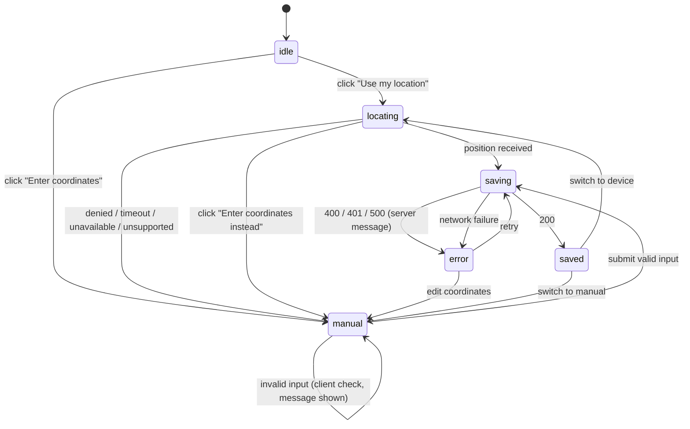

# A user can share their location from the device or by entering coordinates

> **Interim behavior — no user check.** Until user accounts are in place, the
> route saves a location for whatever user id the identity seam returns,
> without checking that a matching user exists. When accounts land, an
> unknown id returns `401` and nothing is written; that change updates this
> spec.

## Why
The map, the SOS alert, and the nearby-incident search all need to know where
the user is. The device's location is the fastest source, but permission can
be denied, the request can time out, or the device may have no GPS. A user in
any of those situations can still type in their coordinates and use the app.

## Where it lives
- `apps/web/app/api/v1/location/route.ts` (`PUT`)
- `apps/web/app/_components/location-picker.tsx` (client component)
- `apps/web/app/_components/device-location.ts` (`getDeviceLocation`, the
  browser Geolocation wrapper reused by the SOS button and the map)
- `packages/domain/src/zod_schemas/location.ts` (`updateLocationSchema`)
- `packages/domain/src/queries/location.ts` (`saveUserLocation`)
- `packages/redis/src/geo.ts` (`updateUserLocation`)

## Behavior
- The browser asks for location only after the user clicks "Use my
  location". Nothing asks on page load.
- The device request uses a 10-second timeout. Permission denied, timeout,
  position unavailable, and an unsupported browser all show the manual form,
  with one line saying why.
- While the device lookup is running, "Enter coordinates instead" switches
  to the manual form. The timeout only starts once the user answers the
  browser's permission prompt, so without this a user who ignores the prompt
  would wait forever. A lookup that finishes after the user switched is
  ignored.
- The manual form has two fields, latitude and longitude. It is a native
  `<form>`: every control is reachable and usable by keyboard, Enter submits,
  and each field has a visible label.
- `PUT /api/v1/location` saves the current user's location. The server
  derives the user via the identity seam (see [auth](../auth.md)); the body
  never contains a user id.
- The payload is validated with `updateLocationSchema`: `latitude` is a number
  from −90 to 90 and `longitude` is a number from −180 to 180, both inclusive
  and both required. Strings are not coerced; the form converts its inputs to
  numbers before sending.
- The manual form validates with the same schema before sending. The server
  validates again and is the authority.
- A valid request replaces the user's previous location (one location per
  user) and returns `200` with `{ latitude, longitude }`.
- Validation failures and malformed JSON return `400` `VALIDATION_ERROR`
  with `{ error: { code, message } }`, and nothing is written.
- The location is stored under the id the identity seam returns, whether or
  not a matching user exists (see the interim note above). Signed-out calls
  return `401`.
- The store is Upstash Redis (see
  [ADR-0012](../../adr/0012-upstash-redis-cloud-dependency.md)). If Upstash is
  unreachable or unconfigured, the route returns `500` `INTERNAL_ERROR`. Raw
  store errors never reach the client.
- After a save, the component shows the source in use: "Using your device
  location" or "Using the location you entered". The user can switch to the
  other source at any time.
- The component shows the server's `error.message` when a save fails. A
  network failure (no response at all) shows "Couldn't reach the server" and
  lets the user retry. No state leaves the user stuck without a way forward.

## UI states

The component holds a single `status` value rather than separate booleans, so
"saving" and "error" cannot be true at once. The submit button's `disabled`
is derived from `status`, not stored.

## Examples

| State / input | Behavior |
|---|---|
| User allows location | `PUT` sends device coordinates; 200; "Using your device location" |
| User denies location | Manual form appears with a reason line |
| Manual `{ latitude: 40.7128, longitude: -74.006 }` | 200; "Using the location you entered" |
| Manual `{ latitude: 91, longitude: 0 }` | Client blocks it; sent directly, the route returns 400 `VALIDATION_ERROR`, nothing written |
| `{ latitude: 90, longitude: -180 }` | 200 (boundaries are inclusive) |
| `{ latitude: "40.7", longitude: 0 }` | 400 `VALIDATION_ERROR` (no coercion) |
| Body is not JSON | 400 `VALIDATION_ERROR` |
| `x-user-id: someone-else` (no such user) | 200; location stored under `someone-else` (interim, no user check) |
| Upstash env vars unset | 500 `INTERNAL_ERROR`; generic message only |
| Dev server stopped, user clicks save | Error state with "Couldn't reach the server"; retry works once the server is back |
| Second save | Replaces the first; only one location per user is stored |

## Verify
- `pnpm vitest run tests/integration/user-location.test.ts` (uses an
  in-memory fake for `@project/redis`; no Upstash account needed).
- With `pnpm dev` running and `UPSTASH_REDIS_REST_URL` /
  `UPSTASH_REDIS_REST_TOKEN` set:
  - `curl -X PUT localhost:3000/api/v1/location -H "content-type: application/json" -d '{"latitude":40.7128,"longitude":-74.006}'`
    returns `200`.
  - The same call with `{"latitude":91,"longitude":0}` and with body `{bad`
    returns `400` `VALIDATION_ERROR` both times.
  - With `-H "x-user-id: someone-else"` it returns `200` (interim, no user
    check).
- In the browser: allow location once and deny it once (reset the site
  permission between runs); trigger every arrow in **UI states**; stop the
  dev server and save to confirm the error state and retry.
- Keyboard only: reach the manual form, fill both fields, and submit
  without a mouse.

## Constraints & decisions
- The route does not check that the current user exists, so the feature
  works before user accounts do. Any id the identity seam returns gets a
  location; adding the check is a behavior change to this spec.
- Locations are stored in Upstash Redis, the one cloud dependency without a
  local stand-in; see [ADR-0012](../../adr/0012-upstash-redis-cloud-dependency.md).
- The location prompt is tied to a user click because browsers penalize
  prompts on page load, and a user who denies it once may not be asked again.
- One current location per user, overwritten on each save. The store keeps no
  history, so nothing here supports a location trail.
- The source ("device" or "entered") is tracked in the component only and is
  not stored on the server; nothing server-side needs it yet.
- The coordinate ranges match `triggerSosAlertSchema`. The two schemas stay
  separate for now; merging them changes the SOS feature and needs that
  spec's update.
- Geolocation requires a secure context, so it works on `localhost` and
  HTTPS but not on a plain-HTTP LAN address. The manual form covers that case.
- Redis geo storage rounds coordinates to roughly 0.6 m precision, so a read
  back may differ slightly from what was sent.

## Out of scope
- Continuous background tracking and "walk home" mode — no spec yet.
- Converting an address to coordinates — no spec yet.
- Showing incidents on the map — no spec yet.
- Using the location in an SOS alert — see [trigger-sos](../alerts/trigger-sos.md).
- Removing the location when the user goes offline — no spec yet.
